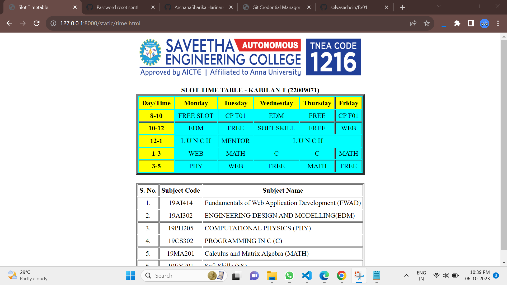

# Ex03 Time Table
## Date: 
## AIM
To write a html webpage page to display your slot timetable.

## ALGORITHM
### STEP 1
Create a Django-admin Interface.

### STEP 2
Create a static folder and inert HTML code.

### STEP 3
Create a simple table using ```<table>``` tag in html.

### STEP 4
Add header row using ```<th>``` tag.

### STEP 5
Add your timetable using ```<td>``` tag.

### STEP 6
Execute the program using runserver command.

## CODE
```
<html>
    <body>
        
        <table>
            <tr bgcolor="green">
                <th>Day/Time</th>
                <th>Monday</th>
            </tr>
            <tr>
                <th bgcolor="green">8-10</th>
                <td bgcolor="yellow" colspan="3">FREE SLOT</td>
                <td>PHY</td>
                <td>CHE</td>
            </tr>
        </table>
    </body>
</html>
```
## OUTPUT


## RESULT
The program for creating slot timetable using basic HTML tags is executed successfully.
